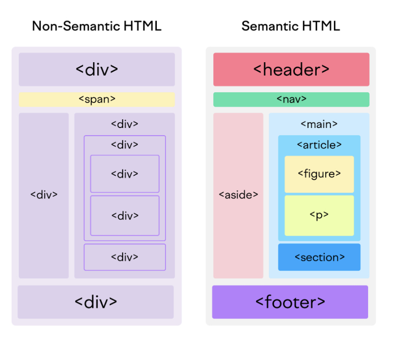

# Web Accessibility 

## Description

The aim of this weeks challenge was to take our learnings from this week which focused on Git, CSS box method, Standard HTML and Semantic HTML  to refactor existing code in an html to make it more web accessible and then deploy the code on github pages.

Below are the user stories and acceptance criteria for this task:
### User Story

```
AS A marketing agency
I WANT a codebase that follows accessibility standards
SO THAT our own site is optimized for search engines
```

### Acceptance Criteria

Your website must meet accessibility standards. You can achieve this completing the following:

* Semantic HTML elements can be found throughout the source code
* HTML elements follow a logical structure independent of styling and positioning
* Image and icon elements contain accessible `alt` attributes
* Heading attributes fall in sequential order
* Title elements contain a concise, descriptive title

## Task

The task was assigned to help us think more about web accessibility and how to tailor our HTML to achieve this requirement. This challenge was interesting and insightful as it touches on other aspects of web development such as Search Enginge Optimisation (SEO) which helps google index your content, website and your resources. 

The problem solved in this task was making simple HTML semantic to make code more accessible while ensuring the functionality is kept in tact (Refactor). This was a realistic insight in to what occurs in a dev role and got me to think more about wbe accessibility when refactoring the code. Inititally, I would use standard html which primarily utilises non-semantic html such as <div> <span> etc. However, with accessibility at the forefront in modern web development pivoting to semantic HTML is better option. 

Here is a visual representation of non-semantic and semantic html and visiually shows just how much easier it is to understand on first glance than non-semantic HTML: 



credit- image source: Semrush

## Workflow

This was a simple task so this could of been done solely from main. However, I wanted to show I knew and understood how git, branching and pull requests work. With each branch I make I act as if it's a ticket that has been assigned to me which contains the stories and AC's hence the branch name EDX-101

Also, regarding git commit message I made it as descriptive as possible. If I had more time my git commit messages would read as follows:
git commit -m " ROB | EDX-101 Updating README.md" 

This type of messaging is more helpful, certaintly, in bigger and more collaborative projects as it allows teams to know whose ticket this is through their initials (ROB), track the ticket through the ticket number/code (EDX-101) and understand the changes through the commit message("updating...). 

## Installation

The challenge is deployed using Github pages the end result can be found here: https://reginaabena19.github.io/EDX-WEEK-1/
When view through an editor ensure live server is installed in order to run the index.html file in the broswer. 

## License
MIT
